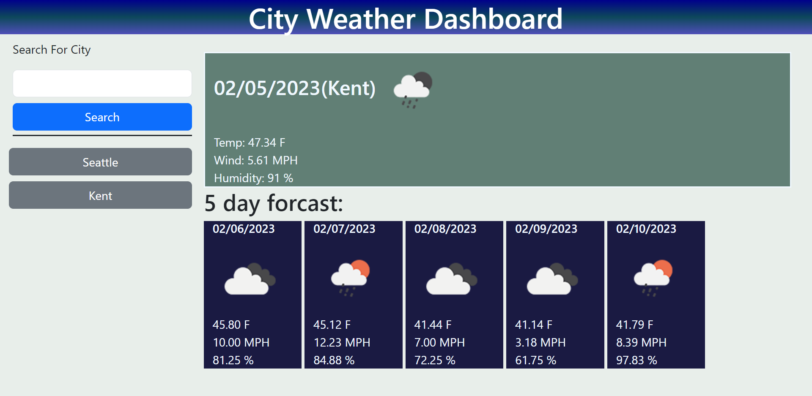
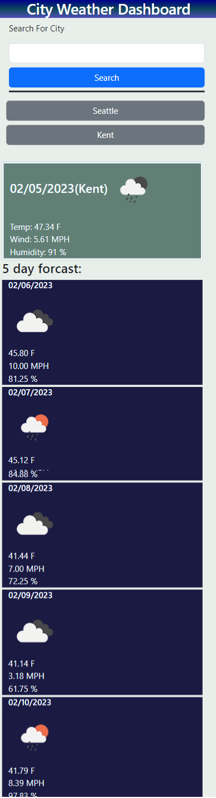

# City Weather Dashboard

## Description

The goal of this project is to build a city waither dashboard application that has a function to search a city by name and it displays current day and f day weather forcast. It is built based on a user story provided by UW for challange 6. The full cntent of user story is in issue #1 of this repo .The values displayed on eache day are  an avareage of all samples of the thatday. It contains a search form on the left and a display area on the right. 

## Usage
When application is loaded  , it will display a text entry for city name and a search button on the left. When city name is interd and search button clicked weather dashboard will be displayed on the left side and a button with the lebel name of the search city will be displayed. The buttuns for searched citys will persist and can be clicked to get the previously searched.

Here is the link to published page https://getnetgit.github.io/City_Weather_Dashboard/ .

 

City weather dashboard

## Credits
I used resorces in UW bootcamp modules and [https://developer.mozilla.org/en-US/], [https://www.w3schools.com/] was also helpful to do some research for this project. 

## License

MIT License

Copyright (c) 2023 GET

Permission is hereby granted, free of charge, to any person obtaining a copy
of this software and associated documentation files (the "Software"), to deal
in the Software without restriction, including without limitation the rights
to use, copy, modify, merge, publish, distribute, sublicense, and/or sell
copies of the Software, and to permit persons to whom the Software is
furnished to do so, subject to the following conditions:

The above copyright notice and this permission notice shall be included in all
copies or substantial portions of the Software.

THE SOFTWARE IS PROVIDED "AS IS", WITHOUT WARRANTY OF ANY KIND, EXPRESS OR
IMPLIED, INCLUDING BUT NOT LIMITED TO THE WARRANTIES OF MERCHANTABILITY,
FITNESS FOR A PARTICULAR PURPOSE AND NONINFRINGEMENT. IN NO EVENT SHALL THE
AUTHORS OR COPYRIGHT HOLDERS BE LIABLE FOR ANY CLAIM, DAMAGES OR OTHER
LIABILITY, WHETHER IN AN ACTION OF CONTRACT, TORT OR OTHERWISE, ARISING FROM,
OUT OF OR IN CONNECTION WITH THE SOFTWARE OR THE USE OR OTHER DEALINGS IN THE
SOFTWARE.
